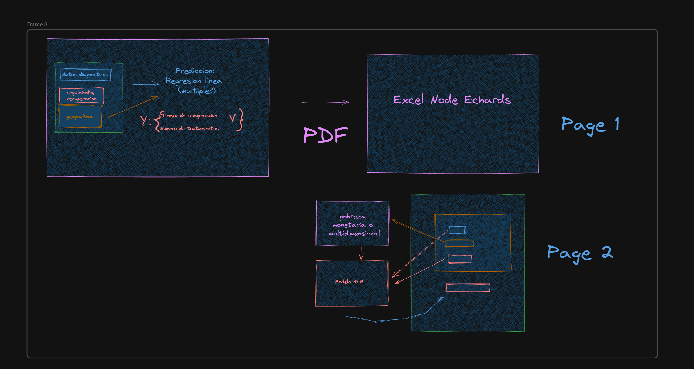

# Niños menores de 36 meses con diagnóstico de anemia en la Región Junín - Dirección Regional de Salud Junín - GRJ

## Introducción

El objetivo es realizar un análisis sobre la anemia infantil en la región Junín.

El dataset utilizado asi como su diccionario y metadatos fueron extraídos y están disponibles en el siguiente enlace: [Datos abiertos gob](https://www.datosabiertos.gob.pe/dataset/ni%C3%B1os-menores-de-36-meses-con-dx-de-anemia-en-la-regi%C3%B3n-jun%C3%ADn-direcci%C3%B3n-regional-de-salud)

## Objetivo

1. Entender las consideraciones demograficas de la anemia infantil en Junin.
2. Crear un modelo para predecir el tiempo de recuperacion y/o el numero de tratamientos segun datos disponibles en el diagnostico inicial.

## Composición del Dataset

El dataset muestra la cantidad de niños menores de 36 meses con diagnóstico de anemia por establecimientos de salud en la Región Junín. Este registro presenta los siguientes campos más resaltantes:

**Datos del Paciente**

- Tipo de seguro
- Datos del paciente niño
  
**Diagnóstico**

- Fecha de diagnóstico con anemia
- Valor de hemoglobina
- Fecha de dosaje
  
**Seguimiento**

- Fecha de dosaje al mes
- Fecha de dosaje a los 3 meses
- Fecha de dosaje a los 6 meses
- Valor de hemoglobina para cada fecha
- Fecha de recuperación
- Fechas de suplementación
- Fecha de fin de tratamiento

**Datos Geográficos**

- Red de salud
- Micro red de salud
- Nombre del establecimiento de salud
- Provincia
- Distrito

## Objetivos

Para medicos y sistemas (cumplimiento de directivas y normativas)

- Verificar variabilidad segun estandares de salud
- Verificar lab anemia al nacimiento (norma)
- Verificar efectividad de cumplimiento de tomas de muestras u normativas

Consultar por obtencion de data de los controles de muestras

Cruce de datos geograficos o aplicacion de clustering
- Califiicar por urbano o rural
- Altitud o ecoregion

Observaciones:
El seguro predominante es el SIS

Contextualizar segun habitantes en el espacio geografico

### Preguntas 

1. ¿Cuántos infantes se recuperan y cuánto tardan en recuperarse?
2. ¿Cómo varían los tiempos de recuperación según los datos geográficos?
3. ¿Cuáles son las diferencias según tipo de seguro?

### Análisis Descriptivo y Exploratorio

1. **Describir la Población de Estudio**:
    - Edad, género y distribución geográfica de los pacientes.
    - Tipos de seguros predominantes.
2. **Describir los Valores de Hemoglobina**:
    - Distribución de los valores de hemoglobina al momento del diagnóstico.
    - Evolución de los valores de hemoglobina en los distintos seguimientos.

## Licencia

De forma consecuente a los datos empleados, el presente repositorio se encuentra bajo la licencia [Open Data Commons Attribution License](http://opendefinition.org/licenses/odc-by/).
